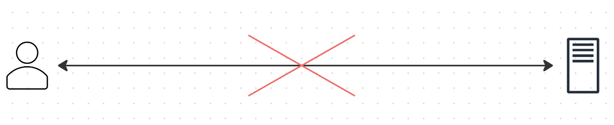
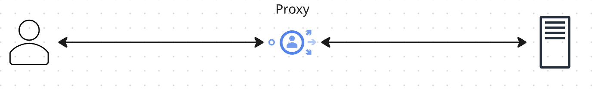
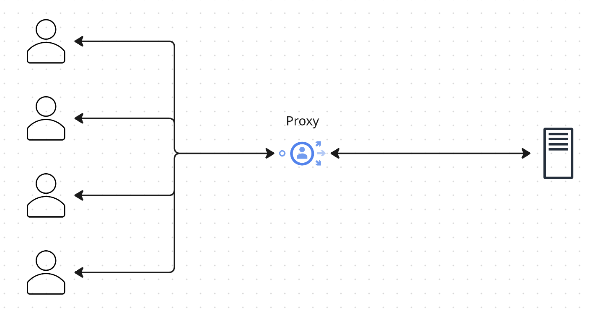
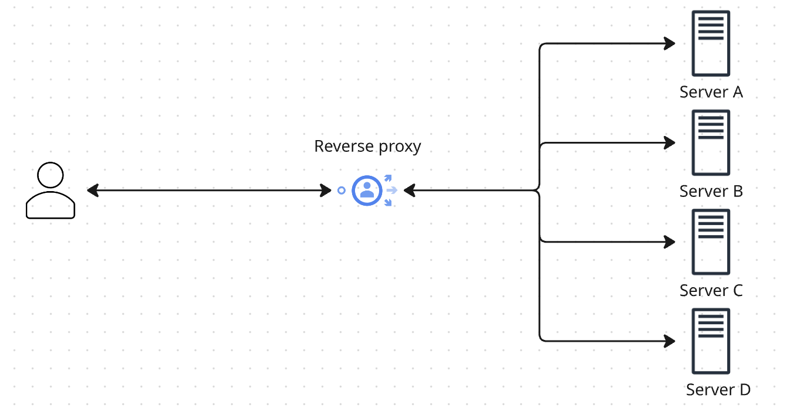

# What Is Reverse Proxy

## What is proxy?

First of all, to understand what a reverse proxy is, we need to understand what a proxy is.

A proxy is an intermediary between a client and a server. It receives requests from clients, forwards them to the server, and then returns the server's response back to the client. At first glance, it may sound hard to understand, so let's look at a simple example.

Let's say you want to access a website, but you cannot do that because, for instance, your country has blocked access to that website (see picture below).

In this case, you can use a so-called `proxy server` that is located in another country where the website is not blocked. You send your request to the proxy server, which then forwards it to the website. The website responds to the proxy server, which then sends the response back to you. This way, you can access the website even though it is blocked in your country.

Now, as we grasp the concept of a forward proxy, we can move on to the next step and understand what a reverse proxy is.

## What is reverse proxy?

So, as we have learned, a proxy is an intermediary between a client and a server, we can illustrate it with many clients using one proxy server this way:

Now, let's reverse the situation and imagine that we have many servers and one user. In this case, we can use a reverse proxy that will receive requests from the user and forward them to the appropriate server (for example, the closest one to the user). The reverse proxy will then return the server's response back to the user. This way, the user does not need to know about the existence of multiple servers and think about what server to contact. The reverse proxy will take care of that for the user and choose the best server to handle the request.

## Why use one

Let's list some of the reasons why you would want to use a reverse proxy:

- **Routing** - a single entry point that fans requests out to different services based on path or domain (`/api/*` → service A, `/static/*` →
  service B).
- **Hiding internal services** - backends are never exposed directly; only the proxy is public, and internal addresses/ports are known only to it. (Makes system architecture more flexible, and also improves security.)
- **Load balancing** — if a service is replicated across several instances, the proxy spreads traffic across them.
- **Rate limiting, auth, caching** — cross-cutting concerns that are easier to solve once, at the proxy, than to duplicate in every backend.

Also, you probably have seen some examples of reverse proxies in the wild. For example, Nginx and Traefik are popular reverse proxies that are used in many production environments. They provide a lot of features out of the box, such as load balancing, caching, and SSL termination. Therefore, if you have experience with these tools, you may already be familiar with more purposes of reverse proxies.
